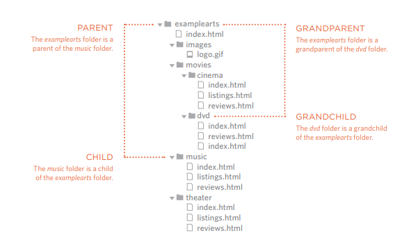

## \<HTML\>
**Links**      
Links are created using the \<a\> element, users can click on anything 
between the opening \<a\> tag and the closing \</a\> tag. We specify 
which page we want to link to using the *href* attribute.      
- \<a href="theLink"\>link text\</a\>
- Links in the same site should have the extension .html
- to add a link for an email we type *mailto* : \<a href="mailto:aabonser@gmail.com"\>Email Haneen\</a\>    
- to open a link in a new page window use attribute target= "_blank"
- If we we want to add a link to a specific part of the same page; by adding the id of that part:     
\<a href="#id"\>link text\</a\> 

**Directory Structure**           

          

## \{CSS\}   
**CSS Layout**          

CSS treats each HTML element as if it is in its own box, this box will either be a:
- block-level: the elements that start in a new line (p, h, ul, li)
- inline: in between the text (img, b, i)       
   
**Containing** or **parent** elemnts: we use them in order to group a number of elements inside one element, it is common to use \<div\> as a containing element. 
Example:        
We put all the conent of the header inside a \<div\>,    
and all the conent of the main inside a seconed \<div\>,     
and the footer content inside a thierd \<div\>.       
all those divs have a containing element which is the \<body\>.    

## JavaScript()
**Functions**      
- **What?**          
A block of code does somthinf for us, it takes inputs in order to return outputs.

- **Why?**       
it mekes the code reusable and a lot clearer.

- **How?**        
There are two ways for writting functions:      
- *Function Declaration:*                 
function name(parameters) {        
    the code..         
}             
name(arguments);       

- *Function expression:*               
var name = function(parameters){             
    the code....            
}             
name(arguments);       

To get a single value from a function(like a result of adding two numbers) we have to use ***Return***

**Pair Programming**        
- **What?**        
is the practice of two developers sharing a single workstation to interactively tackle a coding task together.
- **Why?**        
there are four skills in any language, (R,S,L,W),pair programming touches on all four skills: developers explain out loud what the code should do, listen to others’ guidance, read code that others have written, and write code themselves.       

- **How?**       
It commonly involves 2 roles:      
- The Driver:the one who is typing and the only one whose hands are on the keyboard.
- The Navigator:the one who uses their words to guide the Driver but does not provide any direct input to the computer.

## Difinition List 
- URL: (Uniform Resource Locator) is made up of the domain name followed by the path to a page 
or image.    
- Relative URLs:the URLs that can be used when linking to pages within our own website(with .html extension).
- Variable scope: refers to the places that you can see or access a variable, it is either global or local.

